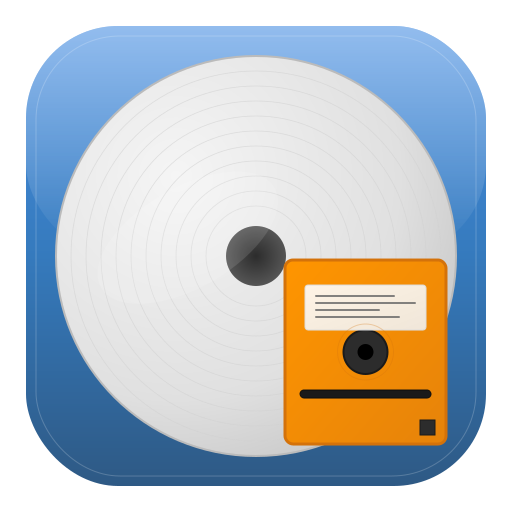

<div align="center">
  
  <h1>AutoRip2MKV for Mac</h1>
  <p><em>DVD & Blu-ray Ripping with Open-Source Decryption</em></p>
  <p><sub>v1.3.0 - Production-ready libdvdcss & libaacs integration</sub></p>
  
  [](https://github.com/gmoyle/AutoRip2MKV-Mac/actions/workflows/ci.yml)
  [](https://github.com/gmoyle/AutoRip2MKV-Mac/actions/workflows/update-stats.yml)
  [](https://github.com/gmoyle/AutoRip2MKV-Mac/actions/workflows/release.yml)
  <!-- Badge refresh trigger: 2025-07-04-v2 -->
</div>

> 🤖 **AI Development Experiment**: This entire application was created using Warp 2.0 AI assistance by someone with zero Swift experience and an Art Degree. [Read the full experiment documentation](./WARP_AI_EXPERIMENT.md) 🎨→👨‍💻

A native macOS application for automatically ripping DVDs and Blu-rays to MKV format using **open-source decryption libraries** (libdvdcss & libaacs) - no third-party applications like MakeMKV required!

## 🎨 App Icon

<div align="center">
  <table>
    <tr>
      <td align="center">
        
        <br><strong>Main Icon</strong>
        <br><em>512×512 Application Icon</em>
      </td>
      <td align="center">
        
        <br><strong>Simple Icon</strong>
        <br><em>128×128 Favicon & Small UI</em>
      </td>
      <td align="center">
        
        <br><strong>Horizontal Logo</strong>
        <br><em>400×120 Documentation & Web</em>
      </td>
    </tr>
  </table>
  
  <p><em>Professional macOS-style icon featuring a large DVD disc with bright orange floppy disk overlay,<br>representing the classic-to-digital conversion process. Floppy disk design recommended by<br><strong>Susanne Moyle</strong> for nostalgic throwback appeal, with anatomically correct vertical access window.</em></p>
</div>

## Features

- **DVD CSS Decryption** - Uses open-source libdvdcss for Content Scramble System decryption
- **Blu-ray AACS Support** - Uses open-source libaacs for AACS decryption and BDMV parsing
- **No Third-Party Applications** - No need for MakeMKV or other separate ripping tools
- **Smart FFmpeg Detection** - Automatically detects system-installed FFmpeg or uses bundled version
- **Homebrew Compatible** - Works seamlessly with Homebrew-installed FFmpeg
- **No Installation Dialogs** - Eliminates unnecessary FFmpeg installation prompts
- **Hardware Acceleration** - Optional VideoToolbox acceleration for improved performance
- **Intelligent First-Run Setup** - Automatically detects and offers to enable hardware acceleration
- **Automatic Drive Detection** - Smart optical drive detection and selection
- Native macOS interface built with Swift and AppKit
- Easy-to-use GUI with persistent settings
 Progress tracking and logging with real-time updates
 Robust error detection and recovery: automatic retry logic and fallback strategies for all critical ripping steps (parsing, decryption, conversion, file I/O)
 Automatic DVD/Blu-ray structure analysis and title detection
 Chapter preservation and metadata inclusion
 Multiple video/audio codec support (H.264, H.265, AV1, AAC, AC3, DTS, FLAC)
 Configurable quality settings
 Enhanced user notifications: workflow status, error alerts, and detailed logs during ripping
 **🤖 100% AI-Generated**: 13,715 lines of Swift code created entirely by AI

## Installation

### 📦 **Recommended: Download Release** (Easiest)

**✨ Just download and run - no building required!**

1. **Download the latest release** from [GitHub Releases](https://github.com/gmoyle/AutoRip2MKV-Mac/releases)
2. **Open the DMG file** and drag AutoRip2MKV to Applications
3. **⚠️ First Launch**: Right-click the app → "Open" to bypass macOS security
4. **FFmpeg**: Already bundled - no downloads needed!
5. **Start ripping!** - Fully self-contained, works offline

> 📋 **Need help with installation?** See the detailed [Installation Guide](INSTALLATION.md) for step-by-step instructions to handle macOS security restrictions.

### 🛠️ **Alternative: Build from Source** (For Developers)

**⚠️ Only needed if you want to modify the code or contribute**

**Requirements:**
- macOS 13.0 or later
- Swift 5.8+ and Xcode Command Line Tools

**Steps:**
```bash
git clone https://github.com/gmoyle/AutoRip2MKV-Mac.git
cd AutoRip2MKV-Mac
swift build && swift run
```

## Usage

### First-Run Setup

When you launch AutoRip2MKV for the first time, the application will:

1. **Verify FFmpeg** - Automatically check that the bundled FFmpeg is available
2. **Hardware Detection** - Test if your Mac supports VideoToolbox hardware acceleration
3. **Acceleration Dialog** - If supported, offer to enable hardware acceleration for faster processing
4. **Save Preferences** - Your choice is remembered for future sessions

### Normal Operation

1. **Insert DVD/Blu-ray** into your Mac's optical drive
2. **Launch AutoRip2MKV** from Applications
3. **Select your disc** from the automatically detected drives dropdown
4. **Choose output directory** where MKV files will be saved
5. **Click "Start Ripping"** - uses bundled FFmpeg for immediate processing
6. **Monitor progress** in the real-time log area

**That's it!** The app handles everything automatically including:
- ✅ FFmpeg bundled (no downloads or Homebrew needed)
- ✅ Drive detection and selection
- ✅ CSS/AACS decryption
- ✅ Video conversion to MKV
- ✅ Optional hardware acceleration (VideoToolbox)

### DVD Structure

The application expects a mounted DVD with the standard VIDEO_TS structure:
```
/Volumes/YOUR_DVD/
└── VIDEO_TS/
    ├── VIDEO_TS.IFO
    ├── VTS_01_0.IFO
    ├── VTS_01_1.VOB
    ├── VTS_01_2.VOB
    └── ...
```

## Development

This project is built using Swift Package Manager and native macOS frameworks:

- **Swift**: Primary programming language
- **AppKit**: Native macOS UI framework
- **Cocoa**: macOS development framework

### Project Structure

```
AutoRip2MKV-Mac/
├── Sources/
│   └── AutoRip2MKV-Mac/
│       ├── main.swift                  # Application entry point
│       ├── AppDelegate.swift           # App lifecycle management
│       ├── MainViewController.swift    # Main UI and user interaction
│       ├── DVDDecryptor.swift         # Native CSS decryption engine
│       ├── DVDStructureParser.swift   # DVD filesystem parser
│       └── DVDRipper.swift           # Main ripping coordinator
├── Tests/
│   └── AutoRip2MKV-MacTests/
│       └── AutoRip2MKV_MacTests.swift
├── Package.swift
└── README.md
```

### Building

**Note:** Most users should download the pre-built release instead of building from source.

```bash
# For development: Build, test, and run
swift build && swift test && swift run
```

## 📚 Documentation

- **[Installation Guide](INSTALLATION.md)** - Detailed setup instructions for macOS
- **[User Guide](WIKI_USER_GUIDE.md)** - Comprehensive feature documentation
- **[Decryption Libraries](DECRYPTION_LIBRARIES.md)** - Integration details for libdvdcss and libaacs
- **[Changelog](CHANGELOG.md)** - Release history and version changes
- **[Roadmap](ROADMAP.md)** - Project timeline and planned features

## 🗺️ Roadmap

See our comprehensive [**Roadmap**](ROADMAP.md) for planned features, enhancements, and long-term project goals including:

- **Enhanced 4K Support**: Ultra HD Blu-ray detection and processing
- **Advanced Automation**: Intelligent batch processing and workflow tools
- **Professional Features**: Metadata management and enterprise tools
- **Cross-Platform Expansion**: Linux and Windows support evaluation
- **AI Development Evolution**: Next-generation code generation experiments

## Contributing

1. Fork the repository
2. Create a feature branch (`git checkout -b feature/amazing-feature`)
3. Commit your changes (`git commit -m 'Add some amazing feature'`)
4. Push to the branch (`git push origin feature/amazing-feature`)
5. Open a Pull Request

## License

This project is licensed under the MIT License - see the LICENSE file for details.

## Technical Details

### CSS/AACS Decryption

This application uses open-source decryption libraries (libdvdcss and libaacs) from VideoLAN for production-ready DVD and Blu-ray decryption:

**DVD Decryption (libdvdcss)**:
- CSS authentication and key management
- Automatic title key retrieval
- Sector-by-sector decryption during read operations
- Battle-tested implementation from VLC Media Player

**Blu-ray Decryption (libaacs)**:
- AACS authentication and processing
- 6144-byte unit decryption
- KEYDB.cfg integration for key management
- Production-ready Blu-ray support

### DVD Structure Analysis

The application parses the DVD structure natively:

- VMGI (Video Manager Information) parsing
- VTS (Video Title Set) analysis
- Program Chain (PGC) information extraction
- Chapter and cell information parsing
- Duration and metadata extraction

### Video Conversion

After decryption, the application uses bundled FFmpeg for video conversion:

- **FFmpeg v7.1.1-tessus** bundled for immediate use
- Support for multiple codecs (H.264, H.265, AV1)
- Audio codec options (AAC, AC3, DTS, FLAC)
- Chapter preservation
- Metadata inclusion
- Quality settings (CRF-based)
- No external dependencies or downloads required

## Legal Notice

This software is intended for legitimate backup purposes of DVDs you legally own. Users are responsible for complying with all applicable laws regarding DVD copying and CSS circumvention in their jurisdiction.

## 🚀 Warp 2.0 AI Experiment

This project represents a groundbreaking experiment in AI-powered software development:

- **Developer**: Art degree, zero Swift experience
- **Code Written by Human**: 0 lines
- **Git Commands by Human**: 0
- **Total Swift Code**: 11,617 lines (100% AI-generated)
- **Source Files**: 35 Swift files
- **Tests**: 277+ comprehensive tests (100.0% pass rate)
- **Git Commits**: 137+
- **Development Method**: 100% AI-assisted via Warp 2.0
- **Latest Release**: v1.3.0 - Open-source decryption libraries (Feb 2026)
- **Features**: DVD/Blu-ray ripping, libdvdcss/libaacs integration, auto drive detection, queue system

**[📖 Read the full experiment documentation](./WARP_AI_EXPERIMENT.md)** to see how AI democratizes software development.

*"From art degree to Swift developer in one conversation"* 🎨→👨‍💻

## Acknowledgments

- **Warp 2.0 Agent Mode** for making this experiment possible
- **Susanne Moyle** for recommending the nostalgic floppy disk design element
- The Swift and macOS development communities
- FFmpeg project for video conversion capabilities
- DVD Forum specifications for DVD structure documentation
